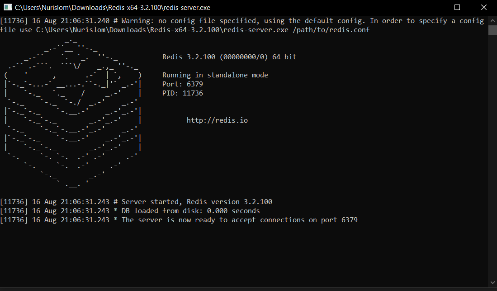

# Introduction

The aim of the Redis OM family of projects is to provide high-level abstractions idiomatically implemented for your
language/platform of choice. We currently cater to the Node.js, Python, .NET and Spring communities.

The Spring Framework is the leading full-stack Java/JEE application framework and Redis OM Spring (ROMS) goal is to
enable developers to easily add the power of Redis to their Spring Boot applications.

Redis OM Spring provides powerful repository and custom object-mapping abstractions built on top of the amazing Spring
Data Redis (SDR) framework.

## RedisStack

Redis Stack is a suite of three components: Redis Stack Server combines open source Redis with RediSearch, RedisJSON,
RedisGraph, RedisTimeSeries and RedisBloom. RedisInsight is a powerful tool for visualizing and optimizing Redis data,
making real-time application development easier and more fun than ever before.

##  Spring and Redis: Up and Running

1. Open Resource file
2. run redis server command 'start redis-server' bash

## Doc

Read Doc : https://redis.io/docs/